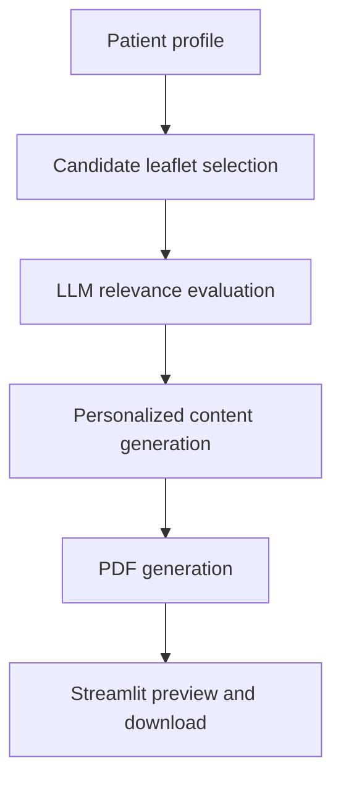

# A-Retrieval-Augmented-Private-Large-Language-Model-for-Precision-Inpatient-Health-Education

# Personalized Patient Education System

A Streamlit-based system for previewing personalized patient education materials generated from patient profiles and relevant health education resources.

This project was developed as a prototype for exploring the use of large language models (LLMs) in personalized medical education.

## Live Demo

The deployed Streamlit application is available at:

[Open the Streamlit Application](請替換成你的Streamlit網址)

> Access to the application may be restricted. Authorized viewers will receive an invitation by email.

## Project Overview

The system is designed to support the following workflow:

1. Read a patient's diagnoses and medication information.
2. Identify potentially relevant patient education materials.
3. Evaluate the clinical relevance of the selected materials.
4. Generate a personalized patient education document.
5. Display and download the generated PDF through a Streamlit interface.

The current repository includes the Streamlit PDF preview interface and demonstration PDF files.

## Current Features

- Search generated PDFs by Subject ID
- Select an existing patient education PDF
- Display a summary of patient information
- Preview PDF documents directly in the browser
- Download generated patient education PDFs
- Support multiple admissions for the same patient

## System Workflow



## Project Structure

```text
patient-education-system/
├── app_ui.py
├── requirements.txt
├── README.md
├── output/
│   └── example patient education PDFs
└── input/
    └── example patient profiles
```

## Installation

### 1. Clone the repository

```bash
git clone https://github.com/你的GitHub帳號/你的Repository名稱.git
cd 你的Repository名稱
```

### 2. Create a virtual environment

On Windows:

```powershell
python -m venv .venv
.\.venv\Scripts\Activate.ps1
```

On macOS or Linux:

```bash
python3 -m venv .venv
source .venv/bin/activate
```

### 3. Install the dependencies

```bash
pip install -r requirements.txt
```

## Run Locally

```bash
streamlit run app_ui.py
```

After starting the application, open:

```text
http://localhost:8501
```

## Data Requirements

The application searches for generated PDF files in:

```text
output/
```

PDF filenames should begin with the corresponding Subject ID:

```text
10002495_衛教手冊.pdf
```

Optional patient profile data can be stored at:

```text
input/patient_profiles.csv
```

The patient profile file should contain at least:

```text
subject_id
diagnoses
prescriptions
```

Optional columns include:

```text
hadm_id
medications
```

## Requirements

- Python 3.10 or later
- Streamlit
- pandas

Install all required Python packages using:

```bash
pip install -r requirements.txt
```

## Privacy and Data Security

This repository is intended for research and demonstration purposes.

- No API keys or credentials are included in this repository.
- No directly identifiable patient information should be uploaded.
- Demonstration data should be synthetic, de-identified, or used according to the applicable data-use agreement.
- Private clinical data must not be committed to GitHub.
- Environment variables and credentials should be stored using secure secret-management methods.

## Current Limitations

- The current Streamlit application focuses on displaying patient summaries and generated PDFs.
- The complete LLM generation pipeline may require additional scripts and external services.
- Clinical relevance still requires professional review.
- The system has not been validated for clinical decision-making.
- The application should not be used to diagnose conditions or determine treatment.

## Disclaimer

This system is intended solely for research, education, and prototype demonstration.

It does not provide medical diagnosis, treatment recommendations, medication instructions, or emergency medical advice. All generated content should be reviewed by qualified healthcare professionals before clinical use.

## Future Development

Potential future improvements include:

- Integration of the complete LLM generation pipeline
- Retrieval support for larger collections of patient education materials
- Improved clinical relevance evaluation
- Automated quality and safety evaluation
- User authentication and access control
- Logging and feedback mechanisms
- Evaluation using retrieval and generation metrics

## Author

**Chia-Yi Chou**  
Master's Student in Biomedical Informatics
Taipei Medical University

## Acknowledgements

This project was developed for academic research in personalized health education and medical artificial intelligence.
